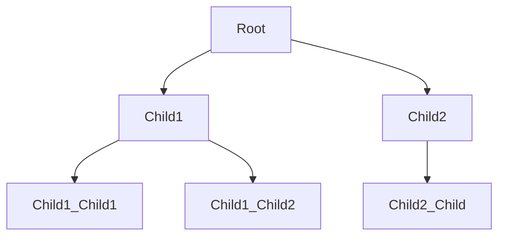

# Basic Binary Tree

A `Tree` data strucuture is a method of structuring the relationship between
your data based on some function.

To understand this, lets start with what this means for a `List`. In a `List` the relationship between the data is "linear" or "ordered"; meaning 

Concretely:

```mermaid
flowchart LR
   Item1 --> Item2 --> Item3 -->
```

## Why Use Them?

asdf

## Details

### Definitions

* `Tree`: A collection of `Data` and `Child` `Tree`s starting at a `Root`
* `Root`: A `Tree` that is not a `Child` of another `Tree`
* `Child`: A `Tree` that is not a `Root`
* `Data`: Any sort of data type you desire.
  > NOTE: Usually your data must be `???`

### Specification

#### English

A `Tree` contains `Data` and (sub)`Tree`s

#### Visually



#### `Racket`

```scheme
(define Tree '(data tree tree ...))
```
