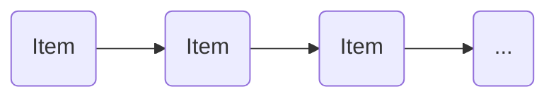
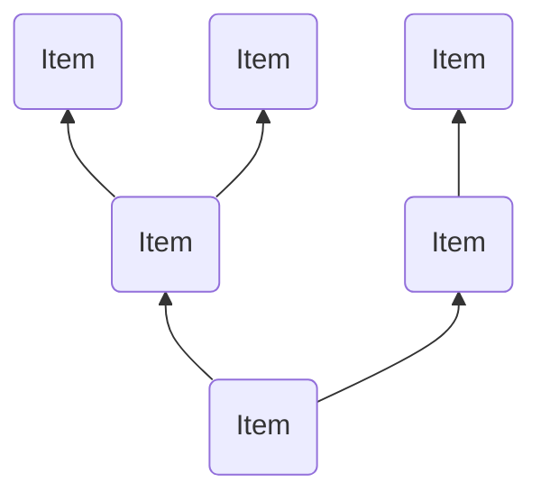
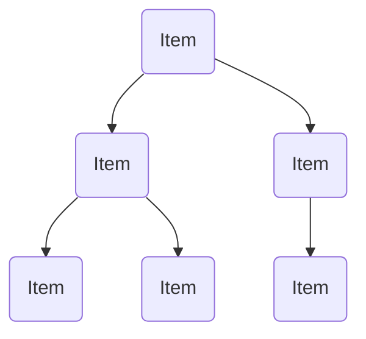
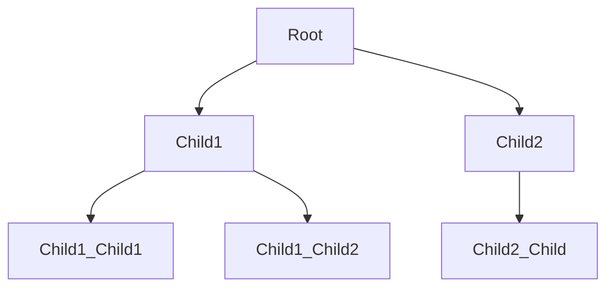

# Basic Binary Tree

A `Tree` data strucuture is a method of structuring the relationship between
your data based on some function.

### A `List`
To understand this, lets start with what this means for a `List`. In a `List` the relationship between the data is "linear" or "ordered"; meaning an item is related to the next or remaining based on when it was added to the structure.

Concretely:



### A `Tree`

Ok, so in a `Tree` data is related based on some given function. This means when adding or search, the traversal of the structure consults a function on which "path" to take.

Obviously, the name `Tree` is meant to evoke a visual, something like:



But, since we are used to reading top-to-bottom we draw them this way:



(To me this evokes a tree/plant root system.)

## Motivation

A `Tree` is a much more efficient data structure when searched. This is because a search occurs along a branch or path from the root, ignore the data on other branches and thus is never compared with.


## Details

### Definitions

* `Node`: A collection of `Data` and `Child` `Tree`s
* `Tree`: A collection of `Node`s starting with a `Root` `Node`
* `Root` (`Node`): A `Node` that is not a `Child` of another `Node`
  * It is the "starting" `Node` for using a `Tree`
* `Child` (`Node`): A `Node` that is not a `Root` `Node`
  * It is a `Node` somewhere in the `Tree`
* `Data`: Any sort of data type you desire.
  > NOTE: Usually your data must be `???`

### Specification

#### English

A `Tree` is a collection of `Node`s which themselves are `Data` and (references/pointers) to other `Node`s.

A `Tree` starts at a _root_ node and one searches for data in the `Tree` by traversing (or decending) based on some function that chooses which _branches_ to continue on.

It is here that a `Tree` becomes a powerful data structure: When choosing which branch (or path) to decend greatly removes the amount of data than is compared.

#### Visual



#### `Racket`

```scheme
(define Tree '(data tree tree ...))
```
