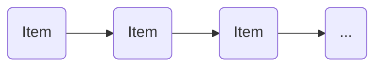
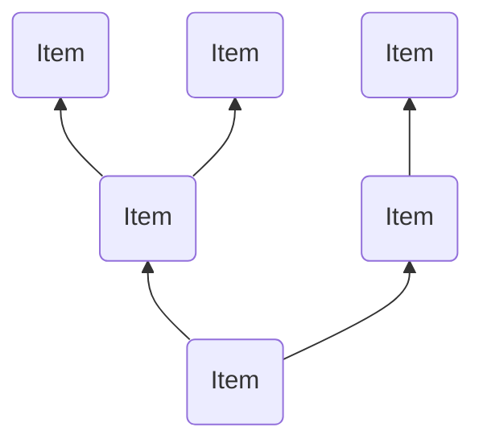
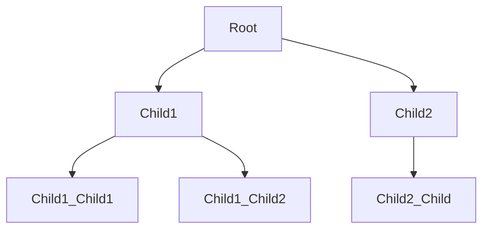

# Basic Binary Tree

A `Tree` data strucuture is a method of structuring the relationship between
your data based on some function.

### A `List`
To understand this, lets start with what this means for a `List`. In a `List` the relationship between the data is "linear" or "ordered"; meaning an item is related to the next or remaining based on when it was added to the structure.

Concretely:



### A `Tree`

Ok, so in a `Tree` data is related based on some given function. This means when adding or search, the traversal of the structure consults a function on which "path" to take.

Obviously, the name `Tree` is meant to evoke a visual, something like:



But, since we are used to reading top-to-bottom we draw them this way:


(To me this evokes a tree/plant root system.)

## Details

### Definitions

* `Tree`: A collection of `Data` and `Child` `Tree`s starting at a `Root`
* `Root`: A `Tree` that is not a `Child` of another `Tree`
* `Child`: A `Tree` that is not a `Root`
* `Data`: Any sort of data type you desire.
  > NOTE: Usually your data must be `???`

### Specification

#### English

A `Tree` contains `Data` and (sub)`Tree`s

#### Visual



#### `Racket`

```scheme
(define Tree '(data tree tree ...))
```
