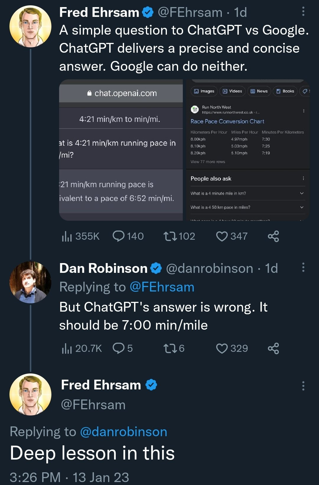

# Pace Calculator

## Origin

The inspiration for this came from this tweet (which `ChatGPT` got wrong! 😆):

https://twitter.com/LiquidSloshalot/status/1614384524024250368

> Obviously tweets might not be truthful but still quite funny!)

## Detail

### Conversions

|            | Miles | Kilometers |
|:----------:|:-----:|:----------:|
| Miles      | 1 | 1.609 |
| Kilometers | 0.621 | 1 |

### Pace

_Pace_ is some `distance` per `time`.

A common example is running a `6minute mile`.

### Algorithm

So, lets say I run a `10min mile`, what is that in kilometers?

Its pretty simple: The time isnt changing, just the distance. So,
this is asking: _How many kilometers did I run in 10minutes?_

Well, given the above conversion of `1mile -> 1.609` I ran `1.609`
kilometers in 10minutes.

Another example: Say I run a third of a kilometer in 1 and a quarter minutes.
What is is my pace (`??min mile`)?

#### Show Your Work!

Pace: `0.33km / 1:15`.

